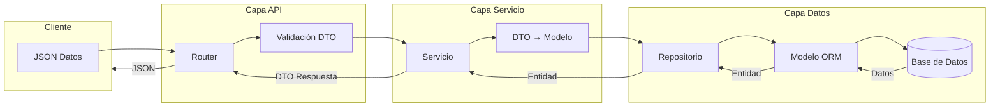

# Data Transfer Objects (DTOs)

Este documento explica el uso y la implementación de Data Transfer Objects (DTOs) en el Sistema de Misiones RPG.

## ¿Qué son los DTOs?

Los DTOs (Data Transfer Objects) son objetos que transportan datos entre procesos o capas de la aplicación. Su principal propósito es reducir el número de llamadas al transferir múltiples parámetros en una sola llamada y encapsular la serialización/deserialización de los datos.

En nuestro sistema, utilizamos DTOs implementados con Pydantic para:

1. **Validar datos de entrada**: Garantizar que los datos recibidos por la API cumplan con los requisitos antes de procesarlos
2. **Transformar datos**: Convertir entre formatos de datos usados en diferentes capas de la aplicación
3. **Controlar la exposición de datos**: Definir exactamente qué campos se exponen en la API
4. **Documentar la API**: Los DTOs se utilizan para generar la documentación automática de Swagger/OpenAPI

## Estructura de DTOs en el proyecto

Nuestro proyecto utiliza una estructura de DTOs jerárquica:

1. **BaseModels**: Clases base que definen campos comunes
2. **Create DTOs**: Para operaciones de creación (POST)
3. **Update DTOs**: Para operaciones de actualización (PUT/PATCH)
4. **Response DTOs**: Para respuestas de la API

## DTOs de Personajes

### `PersonajeBase`

Define los campos obligatorios para un personaje:

```python
class PersonajeBase(BaseModel):
    nombre: str = Field(..., min_length=2, max_length=50)
    clase: str = Field(..., min_length=2, max_length=50)
```

Validaciones:
- `nombre`: Cadena entre 2-50 caracteres (obligatorio)
- `clase`: Cadena entre 2-50 caracteres (obligatorio)

### `PersonajeCreate`

Hereda de `PersonajeBase` y se utiliza para crear nuevos personajes:

```python
class PersonajeCreate(PersonajeBase):
    pass
```

Este DTO hereda las validaciones de `PersonajeBase` y no añade campos adicionales.

### `PersonajeUpdate`

Define campos actualizables de un personaje, todos opcionales:

```python
class PersonajeUpdate(BaseModel):
    nombre: Optional[str] = Field(None, min_length=2, max_length=50)
    clase: Optional[str] = Field(None, min_length=2, max_length=50)
    nivel: Optional[int] = None
    experiencia: Optional[int] = None
```

Validaciones:
- Todos los campos son opcionales
- `nombre`: Si se proporciona, debe tener entre 2-50 caracteres
- `clase`: Si se proporciona, debe tener entre 2-50 caracteres

### `PersonajeResponse`

Define la estructura de respuesta para las operaciones de personaje:

```python
class PersonajeResponse(PersonajeBase):
    id: int
    nivel: int
    experiencia: int
    
    class Config:
        from_attributes = True
```

Campos adicionales:
- `id`: Identificador único del personaje
- `nivel`: Nivel actual del personaje
- `experiencia`: Puntos de experiencia acumulados

La configuración `from_attributes = True` permite crear instancias del DTO directamente desde objetos ORM.

## DTOs de Misiones

### `EstadoMision`

Enumeración para los estados posibles de una misión:

```python
class EstadoMision(str, Enum):
    PENDIENTE = "pendiente"
    EN_PROGRESO = "en_progreso"
    COMPLETADA = "completada"
```

### `MisionBase`

Define los campos básicos de una misión:

```python
class MisionBase(BaseModel):
    nombre: str = Field(..., min_length=3, max_length=50)
    descripcion: str = Field(..., min_length=10, max_length=200)
    experiencia: int = Field(..., gt=0)
```

Validaciones:
- `nombre`: Cadena entre 3-50 caracteres (obligatorio)
- `descripcion`: Cadena entre 10-200 caracteres (obligatorio)
- `experiencia`: Número entero mayor que 0 (obligatorio)

### `MisionCreate`

Hereda de `MisionBase` y se utiliza para crear nuevas misiones:

```python
class MisionCreate(MisionBase):
    pass
```

### `MisionUpdate`

Define campos actualizables de una misión, todos opcionales:

```python
class MisionUpdate(BaseModel):
    nombre: Optional[str] = Field(None, min_length=3, max_length=50)
    descripcion: Optional[str] = Field(None, min_length=10, max_length=200)
    experiencia: Optional[int] = Field(None, gt=0)
    estado: Optional[EstadoMision] = None
```

### `MisionResponse`

Define la estructura de respuesta para las operaciones de misión:

```python
class MisionResponse(MisionBase):
    id: int
    estado: EstadoMision
    fecha_inicio: datetime
    
    class Config:
        from_attributes = True
```

Campos adicionales:
- `id`: Identificador único de la misión
- `estado`: Estado actual de la misión (pendiente, en_progreso, completada)
- `fecha_inicio`: Fecha y hora de creación de la misión

## Flujo de uso de los DTOs

### Ejemplo: Creación de un personaje

1. El cliente envía datos JSON en el cuerpo de la solicitud:
   ```json
   {
     "nombre": "Aragorn",
     "clase": "Guerrero"
   }
   ```

2. FastAPI valida los datos contra el DTO `PersonajeCreate`:
   ```python
   @router.post("/", response_model=PersonajeResponse)
   async def create_personaje(personaje: PersonajeCreate, service: PersonajeService = Depends(get_personaje_service)):
       return service.create_personaje(personaje)
   ```

3. El servicio procesa el DTO validado:
   ```python
   def create_personaje(self, personaje: PersonajeCreate) -> PersonajeResponse:
       db_personaje = self.personaje_repository.create(personaje)
       return PersonajeResponse.model_validate(db_personaje)
   ```

4. El repositorio convierte el DTO en una entidad:
   ```python
   def create(self, personaje: PersonajeCreate) -> Personaje:
       db_personaje = Personaje(**personaje.model_dump())
       self.db.add(db_personaje)
       self.db.commit()
       self.db.refresh(db_personaje)
       return db_personaje
   ```

5. FastAPI serializa la respuesta utilizando `PersonajeResponse`.

## Beneficios del uso de DTOs

1. **Validación automática**: Pydantic valida automáticamente los datos recibidos, generando errores claros cuando no cumplen los requisitos.

2. **Seguridad**: Los DTOs evitan la exposición de campos sensibles o internos de los modelos.

3. **Documentación**: Los DTOs generan automáticamente esquemas OpenAPI para la documentación Swagger.

4. **Separación de preocupaciones**: Los DTOs separan la lógica de validación y presentación de la lógica de negocio.

5. **Flexibilidad**: Permiten diferentes representaciones para la misma entidad según el contexto.

## Diagrama de flujo de datos con DTOs



## Ejemplo de Validación

Si intentamos crear un personaje con datos inválidos:

```json
{
  "nombre": "A",  // Demasiado corto
  "clase": ""     // Campo vacío
}
```

FastAPI responderá automáticamente con un error HTTP 422:

```json
{
  "detail": [
    {
      "loc": ["body", "nombre"],
      "msg": "ensure this value has at least 2 characters",
      "type": "value_error.any_str.min_length"
    },
    {
      "loc": ["body", "clase"],
      "msg": "ensure this value has at least 2 characters",
      "type": "value_error.any_str.min_length"
    }
  ]
}
```

Esta validación ocurre antes de que el código acceda a la base de datos, protegiendo la integridad de los datos.
