# Diagrama de Clases

Este diagrama muestra las principales clases del sistema y sus relaciones.

```mermaid
classDiagram
    %% Modelos
    class Base {
        <<declarative_base>>
    }
    class Personaje {
        +id: Integer
        +nombre: String
        +nivel: Integer
        +clase: String
        +experiencia: Integer
    }
    class Mision {
        +id: Integer
        +nombre: String
        +descripcion: String
        +experiencia: Integer
        +estado: Enum
        +fecha_inicio: DateTime
    }
    class MisionPersonaje {
        +id: Integer
        +mision_id: Integer
        +personaje_id: Integer
    }

    %% DTOs
    class PersonajeBase {
        +nombre: str
        +clase: str
    }
    class PersonajeCreate {
    }
    class PersonajeUpdate {
        +nombre: Optional[str]
        +clase: Optional[str]
        +nivel: Optional[int]
        +experiencia: Optional[int]
    }
    class PersonajeResponse {
        +id: int
        +nivel: int
        +experiencia: int
    }
    
    class MisionBase {
        +nombre: str
        +descripcion: str
        +experiencia: int
    }
    class MisionCreate {
    }
    class MisionUpdate {
        +nombre: Optional[str]
        +descripcion: Optional[str]
        +experiencia: Optional[int]
        +estado: Optional[EstadoMision]
    }
    class MisionResponse {
        +id: int
        +estado: EstadoMision
        +fecha_inicio: datetime
    }

    %% Repositorios
    class PersonajeRepository {
        -db: Session
        +get_all(skip, limit): List[Personaje]
        +get_by_id(personaje_id): Optional[Personaje]
        +create(personaje): Personaje
        +update(personaje_id, personaje): Optional[Personaje]
        +delete(personaje_id): bool
        +add_experience(personaje_id, experience): Optional[Personaje]
        +get_misiones(personaje_id): List[MisionPersonaje]
    }
    
    class MisionRepository {
        -db: Session
        +get_all(skip, limit): List[Mision]
        +get_by_id(mision_id): Optional[Mision]
        +get_by_estado(estado): List[Mision]
        +create(mision): Mision
        +update(mision_id, mision): Optional[Mision]
        +delete(mision_id): bool
        +asignar_personaje(mision_id, personaje_id): Optional[MisionPersonaje]
    }

    %% Servicios
    class PersonajeService {
        -personaje_repository: PersonajeRepository
        -mision_repository: MisionRepository
        -mision_queue: PersonajeMisionQueue
        +get_all_personajes(skip, limit): List[PersonajeResponse]
        +get_personaje_by_id(personaje_id): Optional[PersonajeResponse]
        +create_personaje(personaje): PersonajeResponse
        +update_personaje(personaje_id, personaje): Optional[PersonajeResponse]
        +delete_personaje(personaje_id): bool
        +accept_mission(personaje_id, mision_id): bool
        +complete_mission(personaje_id): Optional[MisionResponse]
        +get_personaje_misiones(personaje_id): List[MisionResponse]
    }
    
    class MisionService {
        -repository: MisionRepository
        -queue: MisionQueue
        +get_all_misiones(skip, limit): List[MisionResponse]
        +get_mision_by_id(mision_id): Optional[MisionResponse]
        +create_mision(mision): MisionResponse
        +update_mision(mision_id, mision_update): Optional[MisionResponse]
        +delete_mision(mision_id): bool
        +assign_personaje_to_mision(mision_id, personaje_id): bool
        +get_next_pending_mission(): Optional[MisionResponse]
        -_handle_completed_mission(mission): void
    }

    %% Colas
    class MisionQueue {
        -queue: deque
        +enqueue(mision): void
        +dequeue(): Optional[Mision]
        +peek(): Optional[Mision]
        +is_empty(): bool
        +size(): int
        +clear(): void
        +load_pending_missions(missions): void
    }
    
    class PersonajeMisionQueue {
        -queues: Dict[int, deque]
        +get_queue(personaje_id): deque
        +enqueue(personaje_id, mision): void
        +dequeue(personaje_id): Optional[Mision]
        +peek(personaje_id): Optional[Mision]
        +get_all(personaje_id): List[Mision]
        +is_empty(personaje_id): bool
        +size(personaje_id): int
        +clear(personaje_id): void
    }

    %% Relaciones
    Base <|-- Personaje
    Base <|-- Mision
    Base <|-- MisionPersonaje
    
    Personaje "1" --> "*" MisionPersonaje
    Mision "1" --> "*" MisionPersonaje
    
    PersonajeBase <|-- PersonajeCreate
    PersonajeBase <|-- PersonajeResponse
    
    MisionBase <|-- MisionCreate
    MisionBase <|-- MisionResponse
    
    PersonajeService --> PersonajeRepository
    PersonajeService --> MisionRepository
    PersonajeService --> PersonajeMisionQueue
    
    MisionService --> MisionRepository
    MisionService --> MisionQueue
```

## Descripción del Diagrama de Clases

El diagrama de clases muestra las principales entidades y sus relaciones en el sistema:

### Modelos
- **Base**: Clase base para todos los modelos SQLAlchemy
- **Personaje**: Representa a un personaje del juego
- **Mision**: Representa una misión que puede ser completada
- **MisionPersonaje**: Relación entre personajes y misiones

### DTOs (Data Transfer Objects)
- **PersonajeBase/MisionBase**: Clases base para los DTOs
- **PersonajeCreate/MisionCreate**: DTOs para creación de entidades
- **PersonajeUpdate/MisionUpdate**: DTOs para actualización de entidades
- **PersonajeResponse/MisionResponse**: DTOs para respuestas API

### Repositorios
- **PersonajeRepository**: Acceso a datos para personajes
- **MisionRepository**: Acceso a datos para misiones

### Servicios
- **PersonajeService**: Lógica de negocio para personajes
- **MisionService**: Lógica de negocio para misiones

### Colas
- **MisionQueue**: Cola FIFO para misiones pendientes
- **PersonajeMisionQueue**: Cola FIFO para misiones por personaje
