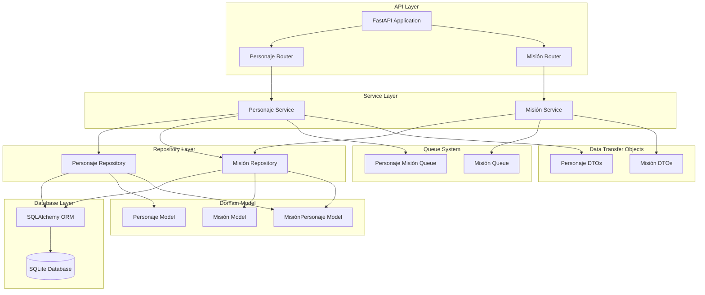

# Diagrama de Componentes

Este diagrama muestra los principales componentes del sistema y cómo interactúan entre sí.

## Descripción del Diagrama de Componentes

El sistema está organizado en capas bien definidas siguiendo el principio de separación de responsabilidades:

### Capa de API (API Layer)
- **FastAPI Application**: Punto de entrada principal de la aplicación
- **Personaje Router**: Gestiona las solicitudes HTTP relacionadas con personajes
- **Misión Router**: Gestiona las solicitudes HTTP relacionadas con misiones

### Capa de Servicio (Service Layer)
- **Personaje Service**: Implementa la lógica de negocio para personajes
- **Misión Service**: Implementa la lógica de negocio para misiones

### Capa de Repositorio (Repository Layer)
- **Personaje Repository**: Proporciona acceso a datos para personajes
- **Misión Repository**: Proporciona acceso a datos para misiones

### Capa de Base de Datos (Database Layer)
- **SQLAlchemy ORM**: Mapeo objeto-relacional
- **SQLite Database**: Base de datos SQLite

### Sistema de Cola (Queue System)
- **Misión Queue**: Gestiona colas de misiones generales
- **Personaje Misión Queue**: Gestiona colas de misiones por personaje

### Modelo de Dominio (Domain Model)
- **Personaje Model**: Define la entidad Personaje
- **Misión Model**: Define la entidad Misión
- **MisiónPersonaje Model**: Define la relación entre personajes y misiones

### Objetos de Transferencia de Datos (DTOs)
- **Personaje DTOs**: DTOs para personajes
- **Misión DTOs**: DTOs para misiones
