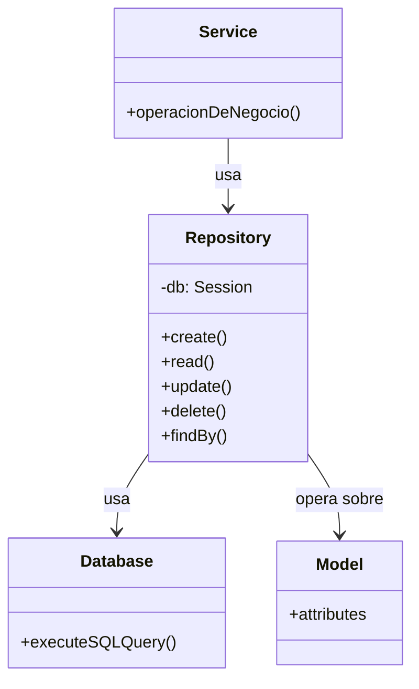
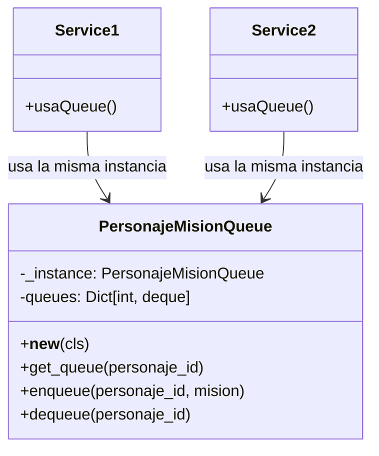
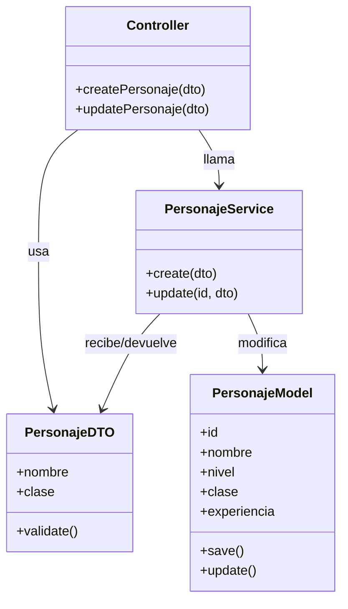
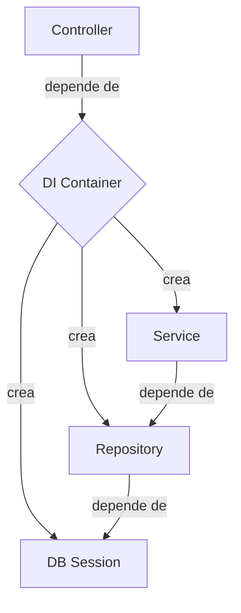
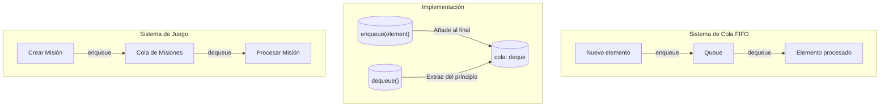
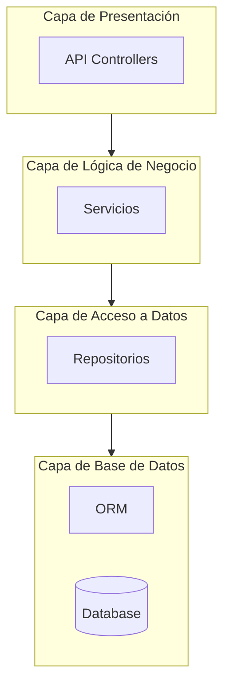

# Diagramas de Patrones de Diseño

## Patrón Repositorio

El patrón Repositorio actúa como una capa intermedia entre la lógica de negocio y la capa de acceso a datos.

## Patrón Singleton

El patrón Singleton garantiza que una clase tenga una única instancia y proporciona un punto de acceso global a ella.

## Patrón DTO (Data Transfer Object)

El patrón DTO separa los datos de transferencia de los modelos del dominio.

## Patrón Inyección de Dependencias

El patrón de Inyección de Dependencias invierte el control de creación de dependencias.

## Patrón FIFO (First In, First Out)

El patrón FIFO implementa una estructura de datos tipo cola donde el primer elemento en entrar es el primero en salir.

## Arquitectura por Capas

La arquitectura por capas separa las responsabilidades del sistema en niveles.

