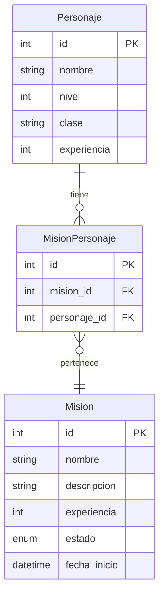

# Modelos ORM y SQLAlchemy

Este documento explica los modelos de datos y el uso del ORM (Object-Relational Mapping) SQLAlchemy en nuestro sistema de misiones RPG.

## ¿Qué es un ORM?

ORM (Object-Relational Mapping) es una técnica de programación que permite convertir datos entre sistemas de tipos incompatibles en lenguajes de programación orientados a objetos. En la práctica, esto significa que podemos trabajar con tablas de base de datos como si fueran objetos de Python.

SQLAlchemy es un ORM popular para Python que proporciona un conjunto completo de patrones conocidos para el acceso a bases de datos, adaptados a un lenguaje simple y Pythonic.

## Configuración de la Base de Datos

### Archivo `database.py`

Este archivo configura la conexión a la base de datos y proporciona utilidades para trabajar con la sesión de la base de datos:

```python
from sqlalchemy import create_engine
from sqlalchemy.orm import sessionmaker, Session
from sqlalchemy.ext.declarative import declarative_base
from contextlib import contextmanager

DATABASE_URL = 'sqlite:///RPG.db'

# Crear el engine de la base de datos
engine = create_engine(DATABASE_URL)

# Crear una clase Session configurada
SessionLocal = sessionmaker(autocommit=False, autoflush=False, bind=engine)

# Crear la base para los modelos declarativos
Base = declarative_base()

def get_db():
    """Dependencia para proporcionar una sesión de base de datos"""
    db = SessionLocal()
    try:
        yield db
    finally:
        db.close()

@contextmanager
def session_scope():
    """Contexto para manejar sesiones de base de datos"""
    session = SessionLocal()
    try:
        yield session
        session.commit()
    except:
        session.rollback()
        raise
    finally:
        session.close()

def init_db():
    """Inicializa la base de datos creando todas las tablas definidas"""
    # Importamos los modelos aquí para asegurar que estén registrados
    from models.Personaje import Personaje
    from models.Mision import Mision
    from models.MisionPersonaje import MisionPersonaje
    
    Base.metadata.create_all(bind=engine)
    print("Base de datos inicializada")
```

Componentes clave:
- `engine`: El motor de base de datos que establece la conexión
- `SessionLocal`: Una fábrica para crear sesiones de base de datos
- `Base`: La clase base declarativa para modelos ORM
- `get_db()`: Función dependency para FastAPI que proporciona una sesión de base de datos
- `session_scope()`: Context manager para usar sesiones con manejo automático de transacciones
- `init_db()`: Función para crear todas las tablas al iniciar la aplicación

## Modelos ORM

### Modelo `Personaje`

```python
from sqlalchemy import Column, Integer, String, ForeignKey, Enum, DateTime
from sqlalchemy.orm import relationship
from database import Base

class Personaje(Base):
    __tablename__ = 'personajes'
    id = Column(Integer, primary_key=True)
    nombre = Column(String(50), nullable=False)
    nivel = Column(Integer, default=1)
    clase = Column(String(50), nullable=False)
    experiencia = Column(Integer, default=0)
    
    mision_personaje = relationship("MisionPersonaje", back_populates="personaje")
```

Campos:
- `id`: Identificador único del personaje (clave primaria)
- `nombre`: Nombre del personaje (obligatorio)
- `nivel`: Nivel del personaje (por defecto 1)
- `clase`: Clase del personaje (obligatorio)
- `experiencia`: Puntos de experiencia (por defecto 0)

Relaciones:
- `mision_personaje`: Relación uno a muchos con la tabla intermedia MisionPersonaje

### Modelo `Mision`

```python
from sqlalchemy import Column, Integer, String, Enum, DateTime
from sqlalchemy.sql import func
from database import Base
from sqlalchemy.orm import relationship

class Mision(Base):
    __tablename__ = 'misiones'
    id = Column(Integer, primary_key=True)
    nombre = Column(String(50), nullable=False)
    descripcion = Column(String(200), nullable=False)
    experiencia = Column(Integer, nullable=False)
    estado = Column(Enum('pendiente', 'en_progreso', 'completada', name='estado_mision'), nullable=False)
    fecha_inicio = Column(DateTime, server_default=func.now(), nullable=False)
    
    mision_personaje = relationship("MisionPersonaje", back_populates="mision")
```

Campos:
- `id`: Identificador único de la misión (clave primaria)
- `nombre`: Nombre de la misión (obligatorio)
- `descripcion`: Descripción detallada (obligatorio)
- `experiencia`: Puntos de experiencia que otorga (obligatorio)
- `estado`: Estado de la misión (pendiente, en_progreso, completada)
- `fecha_inicio`: Fecha de creación de la misión (automático)

Relaciones:
- `mision_personaje`: Relación uno a muchos con la tabla intermedia MisionPersonaje

### Modelo `MisionPersonaje` (Tabla Intermedia)

```python
from sqlalchemy import Column, Integer, ForeignKey
from sqlalchemy.orm import relationship
from database import Base

class MisionPersonaje(Base):
    __tablename__ = 'mision_personaje'
    id = Column(Integer, primary_key=True)
    mision_id = Column(Integer, ForeignKey('misiones.id'), nullable=False)
    personaje_id = Column(Integer, ForeignKey('personajes.id'), nullable=False)

    mision = relationship("Mision", back_populates="mision_personaje")
    personaje = relationship("Personaje", back_populates="mision_personaje")
```

Campos:
- `id`: Identificador único de la asignación
- `mision_id`: ID de la misión (clave foránea)
- `personaje_id`: ID del personaje (clave foránea)

Relaciones:
- `mision`: Relación inversa hacia la misión
- `personaje`: Relación inversa hacia el personaje

## Diagrama de la Base de Datos



## Uso del ORM en la Aplicación

### En los Repositorios

Los repositorios encapsulan las operaciones de base de datos para cada modelo. Por ejemplo, el `PersonajeRepository`:

```python
class PersonajeRepository:
    def __init__(self, db: Session):
        self.db = db
    
    def get_all(self, skip: int = 0, limit: int = 100) -> List[Personaje]:
        return self.db.query(Personaje).offset(skip).limit(limit).all()
    
    def get_by_id(self, personaje_id: int) -> Optional[Personaje]:
        return self.db.query(Personaje).filter(Personaje.id == personaje_id).first()
    
    def create(self, personaje: PersonajeCreate) -> Personaje:
        db_personaje = Personaje(**personaje.model_dump())
        self.db.add(db_personaje)
        self.db.commit()
        self.db.refresh(db_personaje)
        return db_personaje
    
    # ...Otros métodos...
```

### En los Servicios

Los servicios utilizan los repositorios para implementar la lógica de negocio:

```python
class PersonajeService:
    def __init__(self, 
                personaje_repository: PersonajeRepository, 
                mision_repository: MisionRepository,
                mision_queue: PersonajeMisionQueue):
        self.personaje_repository = personaje_repository
        self.mision_repository = mision_repository
        self.mision_queue = mision_queue
    
    def get_personaje_by_id(self, personaje_id: int) -> Optional[PersonajeResponse]:
        personaje = self.personaje_repository.get_by_id(personaje_id)
        if personaje:
            return PersonajeResponse.model_validate(personaje)
        return None
    
    # ...Otros métodos...
```

### En los Routers

Los routers inyectan las dependencias necesarias para los servicios:

```python
def get_personaje_service(db: Session = Depends(get_db)):
    personaje_repo = PersonajeRepository(db)
    mision_repo = MisionRepository(db)
    queue = PersonajeMisionQueue()
    return PersonajeService(personaje_repo, mision_repo, queue)
```

## Relación de Muchos a Muchos con Cola FIFO

La relación entre `Personaje` y `Mision` a través de `MisionPersonaje` permite implementar un sistema de cola FIFO para las misiones asignadas a un personaje:

1. Cuando un personaje acepta una misión, se crea un registro en `MisionPersonaje`
2. Este registro se añade también a una cola en memoria (`PersonajeMisionQueue`)
3. Cuando el personaje completa una misión, se extrae la primera misión de la cola (FIFO)

## Operaciones SQLAlchemy Comunes

### Consultas Básicas

```python
# Obtener todos los registros
db.query(Personaje).all()

# Filtrar por condición
db.query(Personaje).filter(Personaje.nivel > 5).all()

# Obtener un solo registro por ID
db.query(Personaje).filter(Personaje.id == personaje_id).first()

# Contar registros
db.query(Personaje).filter(Personaje.clase == "Guerrero").count()
```

### Inserciones y Actualizaciones

```python
# Crear nuevo registro
nuevo_personaje = Personaje(nombre="Legolas", clase="Arquero")
db.add(nuevo_personaje)
db.commit()
db.refresh(nuevo_personaje)  # Actualiza el objeto con datos de la BD (como el ID generado)

# Actualizar registro
personaje = db.query(Personaje).filter(Personaje.id == personaje_id).first()
personaje.nivel += 1
db.commit()
```

### Eliminaciones

```python
# Eliminar un registro
personaje = db.query(Personaje).filter(Personaje.id == personaje_id).first()
db.delete(personaje)
db.commit()

# Eliminar varios registros
db.query(Personaje).filter(Personaje.nivel < 2).delete()
db.commit()
```

### Joins y Relaciones

```python
# Obtener personajes con sus misiones
personajes_con_misiones = db.query(Personaje).options(
    joinedload(Personaje.mision_personaje).joinedload(MisionPersonaje.mision)
).all()

# Para cada personaje, acceder a sus misiones
for personaje in personajes_con_misiones:
    for mp in personaje.mision_personaje:
        print(f"{personaje.nombre} tiene la misión: {mp.mision.nombre}")
```

## Resumen

El uso de SQLAlchemy como ORM en este proyecto proporciona:

1. Una abstracción de la base de datos que permite trabajar con objetos Python
2. Manejo automático de conexiones y transacciones
3. Definición declarativa de modelos con relaciones
4. Consultas expresivas y seguras frente a inyección SQL
5. Integración sencilla con FastAPI a través de dependencias
