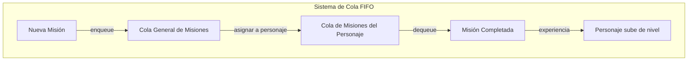

# Implementación del TDA_Cola en el Sistema de Misiones

## ¿Qué es un TDA_Cola?

Un Tipo de Dato Abstracto Cola (TDA_Cola) o FIFO (First In, First Out) es una estructura de datos que sigue el principio "primero en entrar, primero en salir". En una cola, el elemento que se inserta primero es el primero en ser eliminado.

La estructura de datos cola se comporta como una fila de personas: la primera persona en llegar es la primera en ser atendida y salir de la fila.

## Operaciones básicas del TDA_Cola

Un TDA_Cola típico implementa las siguientes operaciones:

1. **Enqueue**: Inserta un elemento al final de la cola
2. **Dequeue**: Elimina y devuelve el elemento al frente de la cola
3. **Peek/Front**: Consulta el elemento al frente sin eliminarlo
4. **IsEmpty**: Verifica si la cola está vacía
5. **Size**: Devuelve el número de elementos en la cola

## Implementación en el Sistema de Misiones RPG

En nuestro sistema de misiones RPG, hemos implementado dos tipos de colas FIFO:

### 1. Cola General de Misiones (`misionFIFO.py`)

Esta clase implementa una cola para todas las misiones pendientes en el sistema:

```python
class MisionQueue:
    def __init__(self):
        self.queue = deque()  # Usamos deque de collections por su eficiencia en operaciones FIFO
        
    def enqueue(self, mision: Mision) -> None:
        """Añade una misión a la cola"""
        if mision.estado == "pendiente":
            self.queue.append(mision)
            
    def dequeue(self) -> Optional[Mision]:
        """Obtiene la siguiente misión pendiente"""
        if self.is_empty():
            return None
        return self.queue.popleft()
    
    def peek(self) -> Optional[Mision]:
        """Ver la siguiente misión sin sacarla de la cola"""
        if self.is_empty():
            return None
        return self.queue[0]
    
    def is_empty(self) -> bool:
        """Verifica si la cola está vacía"""
        return len(self.queue) == 0
```

### 2. Cola de Misiones por Personaje (`personaje_mision_queue.py`)

Esta clase implementa colas individuales para cada personaje, usando el patrón Singleton:

```python
class PersonajeMisionQueue:
    """Implementa el patrón Singleton para gestionar colas FIFO de misiones por personaje"""
    _instance = None
    
    def __new__(cls):
        if cls._instance is None:
            cls._instance = super(PersonajeMisionQueue, cls).__new__(cls)
            cls._instance.queues = {}  # Diccionario de colas: personaje_id -> deque
        return cls._instance
    
    def get_queue(self, personaje_id: int) -> deque:
        """Obtiene la cola de misiones para un personaje específico"""
        if personaje_id not in self.queues:
            self.queues[personaje_id] = deque()
        return self.queues[personaje_id]
    
    def enqueue(self, personaje_id: int, mision: Mision) -> None:
        """Añade una misión a la cola de un personaje"""
        queue = self.get_queue(personaje_id)
        queue.append(mision)
    
    def dequeue(self, personaje_id: int) -> Optional[Mision]:
        """Obtiene la siguiente misión pendiente para un personaje"""
        queue = self.get_queue(personaje_id)
        if len(queue) == 0:
            return None
        return queue.popleft()
```

## Complejidad Algorítmica

Las operaciones en nuestra implementación de cola tienen las siguientes complejidades:

| Operación | Complejidad | Descripción |
|-----------|-------------|-------------|
| **Enqueue** | O(1) | Tiempo constante para añadir al final |
| **Dequeue** | O(1) | Tiempo constante para eliminar del frente |
| **Peek** | O(1) | Tiempo constante para acceder al frente |
| **IsEmpty** | O(1) | Tiempo constante para verificar si está vacía |
| **Size** | O(1) | Tiempo constante para obtener el tamaño |

## Ventajas del TDA_Cola en este Sistema

1. **Orden Garantizado**: Las misiones se procesan en el mismo orden en que fueron asignadas, lo que proporciona un sistema justo y predecible.

2. **Separación de Responsabilidades**: Cada personaje tiene su propia cola, lo que permite un manejo independiente de misiones.

3. **Eficiencia**: Las operaciones principales (encolar y desencolar) son O(1), lo que hace el sistema eficiente incluso con muchas misiones.

4. **Simplicidad**: La estructura es intuitiva, fácil de entender e implementar.

## Flujo de trabajo en el Sistema

El siguiente diagrama muestra cómo las colas se utilizan en el flujo de trabajo del sistema:



## Ejemplo de Uso

### Creación de una misión y entrada a la cola general

```python
# En MisionService
def create_mision(self, mision: MisionCreate) -> MisionResponse:
    db_mision = self.repository.create(mision)
    # Al crear una misión, la añadimos a la cola general de misiones pendientes
    self.queue.enqueue(db_mision)
    return MisionResponse.model_validate(db_mision)
```

### Asignación de misión a un personaje

```python
# En PersonajeService
def accept_mission(self, personaje_id: int, mision_id: int) -> bool:
    # Verificaciones...
    
    # Cambiar estado de la misión
    self.mision_repository.update(mision_id, {"estado": EstadoMision.EN_PROGRESO})
    
    # Agregar a la cola del personaje
    self.mision_queue.enqueue(personaje_id, mision)
    
    return True
```

### Completar una misión (desencolado)

```python
# En PersonajeService
def complete_mission(self, personaje_id: int) -> Optional[MisionResponse]:
    # Verificaciones...
    
    # Obtener la siguiente misión en la cola (FIFO)
    mision = self.mision_queue.dequeue(personaje_id)
    
    # Actualizar estado y añadir experiencia...
    
    return MisionResponse.model_validate(mision)
```

## Conclusión

El TDA_Cola proporciona la estructura perfecta para implementar un sistema ordenado de misiones, permitiendo que los personajes completen sus tareas en un orden justo y predecible. La implementación mediante `deque` en Python ofrece un rendimiento óptimo para las operaciones de cola requeridas.
